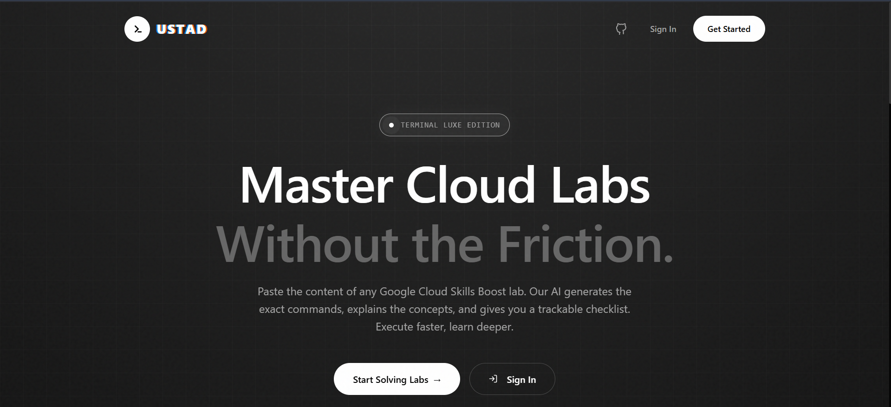
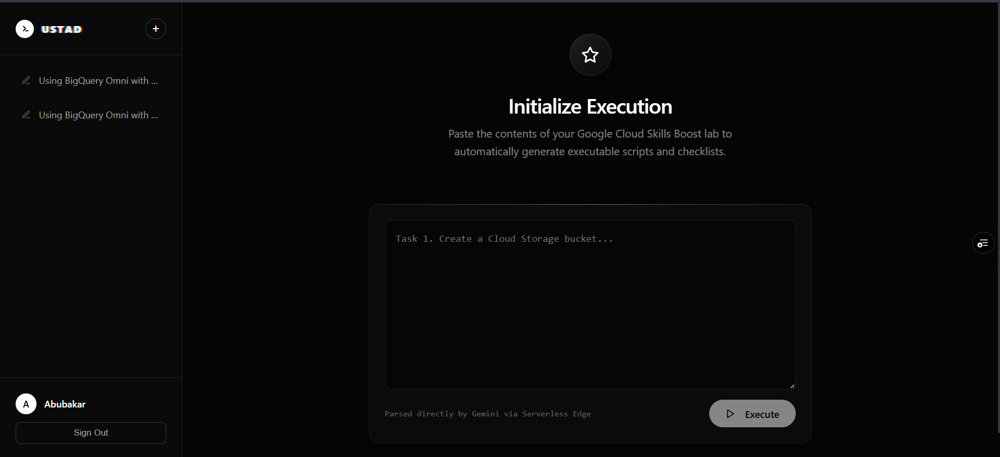

# Ustad

**Master Google Cloud Labs Without the Friction.**

Ustad is an AI-powered tool that converts Google Cloud Skills Boost lab instructions into executable bash scripts. Paste any lab content, get precise gcloud/gsutil/bq commands, track your progress, and export solutions to Markdown.


## Screenshots

### Landing Page


### Dashboard


## Features

- **AI-Powered Script Generation** — Gemini analyzes lab instructions and generates exact CLI commands
- **Universal Lab Support** — Works with any Google Cloud Skills Boost lab
- **Progress Tracking** — Persistent checklist tied to your account
- **Markdown Export** — Export solutions for your personal knowledge base
- **Dark Terminal Aesthetic** — Sleek, developer-friendly UI

## Tech Stack

| Category | Technology |
|----------|------------|
| Framework | Next.js 16.1.6 |
| Runtime | React 19.2.3 |
| Authentication | Clerk |
| Database | PostgreSQL (Supabase) |
| ORM | Prisma 7.4.2 |
| AI | Google Gemini |
| Styling | Custom CSS |

## Getting Started

### Prerequisites

- Node.js 18+
- PostgreSQL database (Supabase recommended)
- Google Gemini API key
- Clerk account for authentication

### Installation

1. **Clone the repository**
   ```bash
   git clone https://github.com/abubakarp789/ustad.git
   cd ustad
   ```

2. **Install dependencies**
   ```bash
   npm install
   ```

3. **Set up environment variables**

   Create a `.env.local` file in the root directory:

   ```env
   # Clerk Authentication
   NEXT_PUBLIC_CLERK_PUBLISHABLE_KEY=pk_test_...
   CLERK_SECRET_KEY=sk_test_...
   NEXT_PUBLIC_CLERK_SIGN_IN_URL=/sign-in
   NEXT_PUBLIC_CLERK_SIGN_UP_URL=/sign-up

   # Gemini API
   GEMINI_API_KEY=AIza...

   # Database (Supabase PostgreSQL)
   DATABASE_URL=postgresql://...
   DIRECT_URL=postgresql://...
   ```

4. **Set up the database**

   Push Prisma schema to your database:
   ```bash
   npx prisma db push
   ```

5. **Run the development server**
   ```bash
   npm run dev
   ```

6. **Open the app**
   
   Visit [http://localhost:3000](http://localhost:3000)

## Project Structure

```
lab-buddy/
├── prisma/
│   └── schema.prisma       # Database schema
├── src/
│   ├── app/
│   │   ├── page.tsx        # Landing page
│   │   ├── layout.tsx      # Root layout with ClerkProvider
│   │   ├── globals.css     # All styling
│   │   ├── dashboard/      # Main dashboard
│   │   │   └── page.tsx   # Dashboard UI
│   │   ├── sign-in/        # Clerk sign-in
│   │   ├── sign-up/       # Clerk sign-up
│   │   └── api/
│   │       ├── solve/     # AI solution generation
│   │       └── history/   # Lab history CRUD
│   └── lib/
│       ├── prisma.ts       # Prisma client
│       └── types.ts       # TypeScript interfaces
├── .env.local              # Environment variables
├── next.config.ts          # Next.js config
├── package.json            # Dependencies
└── tsconfig.json           # TypeScript config
```

## How It Works

### 1. User Pastes Lab Content
User pastes the content of any Google Cloud Skills Boost lab into the dashboard textarea.

### 2. AI Analysis
The content is sent to `/api/solve` which uses Google Gemini to:
- Parse the lab objectives
- Convert manual UI steps to CLI equivalents
- Generate executable bash scripts with comments

### 3. Save & Track
Labs are saved to PostgreSQL via Prisma. Users can:
- View history in the sidebar
- Mark tasks as complete
- Delete labs

### 4. Export
Users can export their generated solutions to Markdown for offline reference.

## Database Schema

### Lab Model
```prisma
model Lab {
  id             String   @id @default(uuid())
  userId         String   // Clerk User ID
  labTitle       String
  labDescription String?
  pastedContent  String
  createdAt      DateTime @default(now())
  updatedAt      DateTime @updatedAt
  tasks          Task[]
}
```

### Task Model
```prisma
model Task {
  id          String  @id @default(uuid())
  labId       String
  lab         Lab     @relation(fields: [labId], references: [id], onDelete: Cascade)
  title       String
  description String
  script      String
  order       Int     // Maintains task sequence
}
```

## API Routes

### `POST /api/solve`
Generates lab solutions using Gemini AI.

**Request:**
```json
{
  "pastedContent": "Task 1. Create a Cloud Storage bucket..."
}
```

**Response:**
```json
{
  "labTitle": "Lab Title",
  "tasks": [
    {
      "id": "task-1",
      "title": "Create Storage Bucket",
      "description": "Create a GCS bucket",
      "script": "# Create bucket\ngsutil mb -l us gs://<BUCKET_NAME>"
    }
  ]
}
```

### `GET /api/history`
Retrieves all labs for the authenticated user.

### `POST /api/history`
Saves a new lab to the database.

### `DELETE /api/history?id=<lab-id>`
Deletes a lab from the database.

## Environment Variables Reference

| Variable | Description |
|----------|-------------|
| `NEXT_PUBLIC_CLERK_PUBLISHABLE_KEY` | Clerk publishable key |
| `CLERK_SECRET_KEY` | Clerk secret key |
| `GEMINI_API_KEY` | Google Gemini API key |
| `DATABASE_URL` | PostgreSQL connection string (pooler) |
| `DIRECT_URL` | PostgreSQL direct connection string |

## Scripts

```bash
npm run dev      # Start development server
npm run build    # Build for production
npm run start    # Start production server
```

## Deployment

### Vercel (Recommended)

1. Push your code to GitHub
2. Import project in Vercel
3. Add environment variables in Vercel dashboard
4. Deploy

### Self-Hosted

```bash
npm run build
npm run start
```

## License

MIT

---

Built with 💻 during Ramzan by [Abu Bakar](https://www.linkedin.com/in/abubakarp56/) for GDG Live Pakistan(Vibe Code till Sehri).
